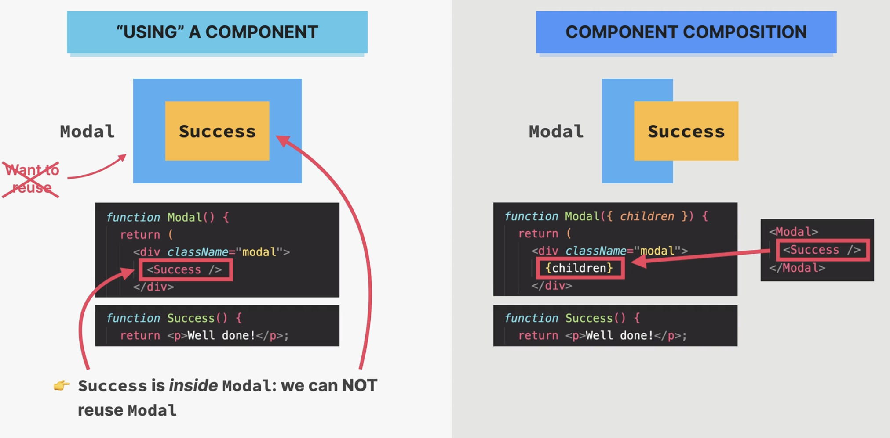
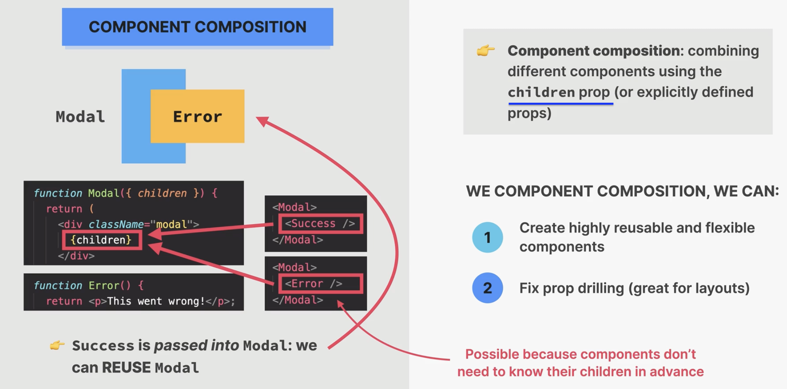
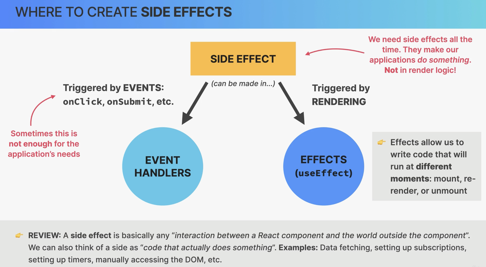
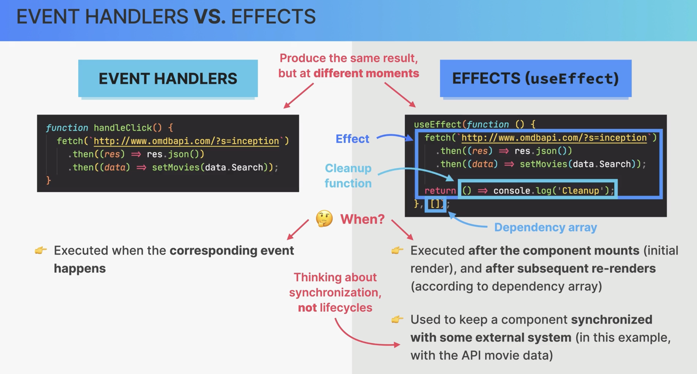

## Sample Application

Below is the reference used for this application

https://usepopcorn.netlify.app/

## Props Drilling

Props Drilling is a practice in which a prop or data is passed from one parent component to one or lower children's components, resulting in multiple levels of the component tree

### Why avoid prop drilling in React?

- Code Complexity: As components grow, prop drilling increases code complexity as it is difficult to track the flow of data through various components.

- Reduced Maintainability: It will become very challenging to maintain the code with prop drilling

### Does prop drilling cause performance issues?

- Performance Overhead: Prop drilling can impact application performance, especially when dealing with large-scale applications. Passing props through numerous intermediary components can lead to unnecessary re-renders, affecting the overall performance of the application.

## Component Composition

- Component composition is a way to solve the problem of props drilling. It involves creating a component that is responsible for passing props to other components. This can make the code easier to maintain and understand.

## Side Effects

Side Effect is basically "any interaction between a React Component and the outside world". This includes data fetching, manually changing the DOM, and setting up subscriptions.

