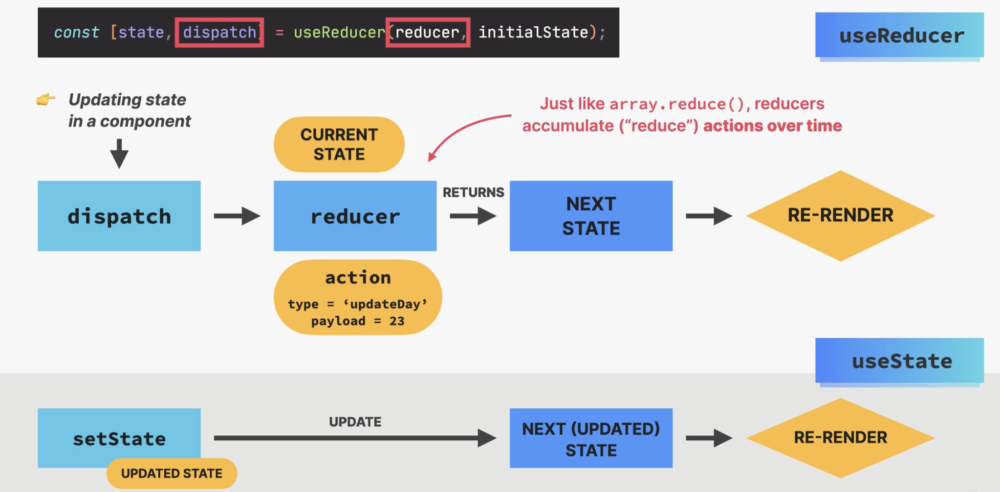

### useReducer

- useReducer is a hook that is used for state management in React. It is an alternative to useState. It is mostly used to manage state objects that contain multiple sub-values. It is similar to Redux, but it is built into React.


```js
const defineCount = function (e) {
  dispatch({ type: "setCount", payload: Number(e.target.value) });
};
```




