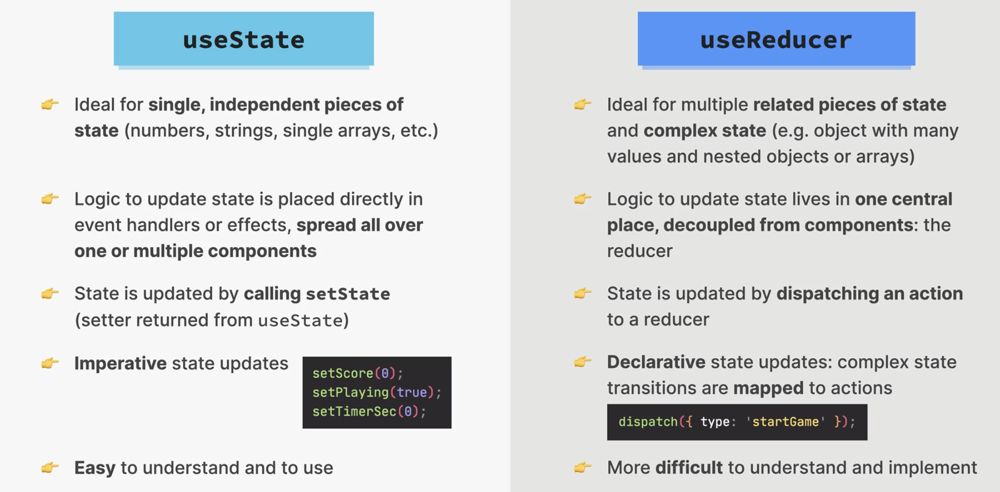
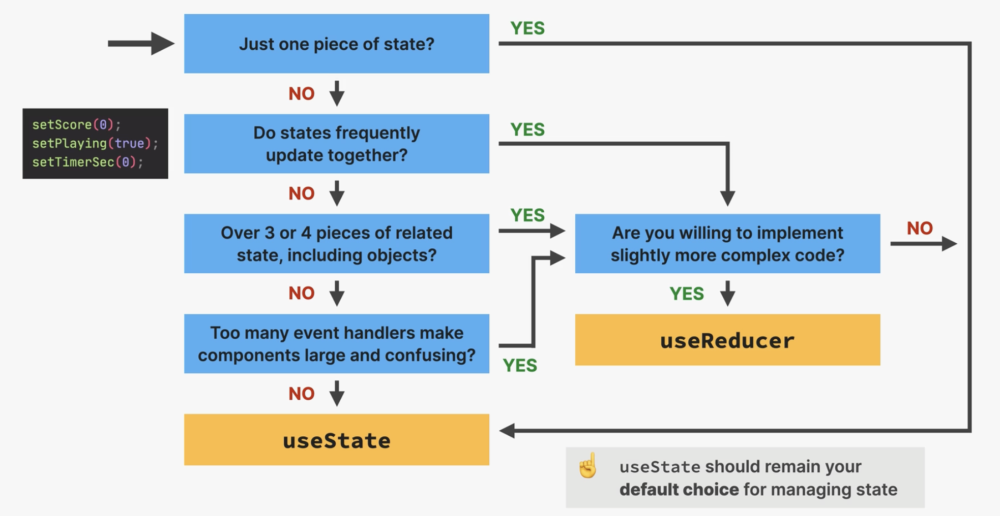

### Run Dummy API Server

Added below entry to package.json

```json
"scripts": {
    "server": "json-server --watch data/questions.json --port 9001"
  },
```

```bash
npm run server
```

### useState vs useReducer



### When to use useReducer


