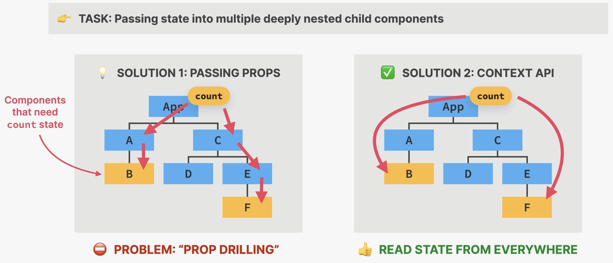
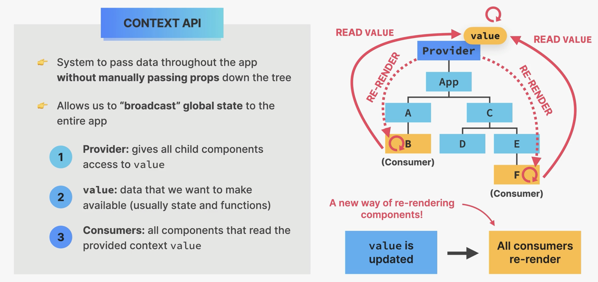
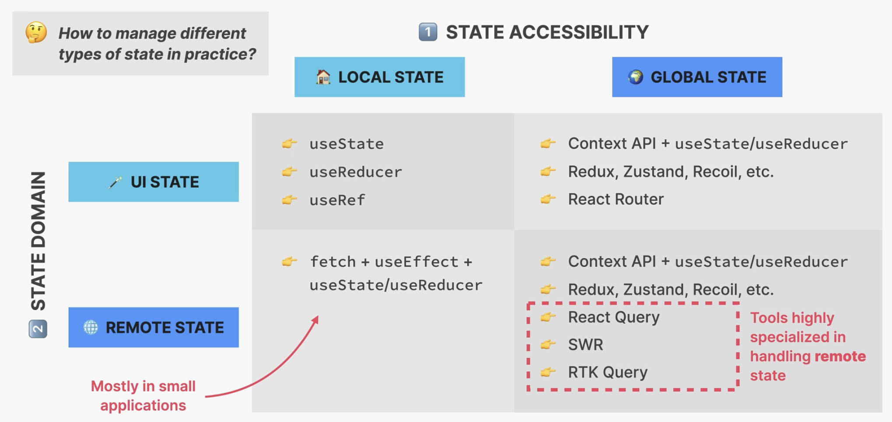

## Prop drilling issue

Prop drilling is a term used in React to describe the process of passing props from a parent component to a child component, and then to another child component, and so on. This can become a problem when you have a deeply nested component tree, as you may need to pass props through many levels of components in order to get them to the component where they are needed.

## Context API

The Context API is a feature that was introduced in React 16.3. It allows you to pass props down to deeply nested components without having to pass the props through each level of the component tree. This can help to reduce the amount of prop drilling in your application and make your code cleaner and easier to maintain.

## State Types

