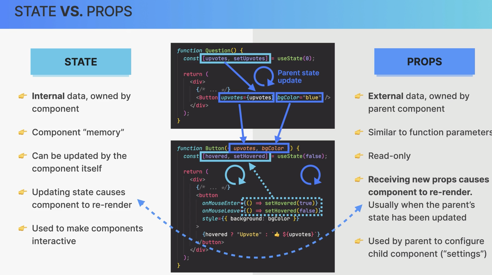
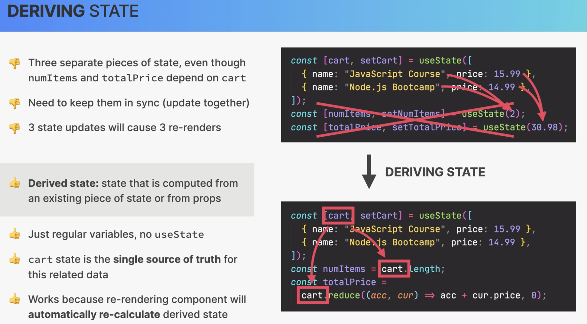

## Project Creation

```bash
npx create-react-app@5 example9-travellist
```

## Install dependencies

```bash
npm install
```

## Start

```bash
npm start
```

## React Controlled Elements

In essence, a controlled component is one where the data, typically input form data, is handled by the React state mechanism. Rather than allowing the DOM to manage this data, React takes charge, ensuring that data handling and changes are consistent with the React paradigm.

## State vs Props



## Lift State Up

Sometimes, you want the state of two components to always change together. To do it, remove state from both of them, move it to their closest common parent, and then pass it down to them via props. This is known as `lifting state up`, and it’s one of the most common things you will do writing React code.

## Derived State

Sometimes, you might want to derive state based on the props that are passed to a component. This is known as `derived state`. It’s a common pattern in React to derive state based on state or props.


